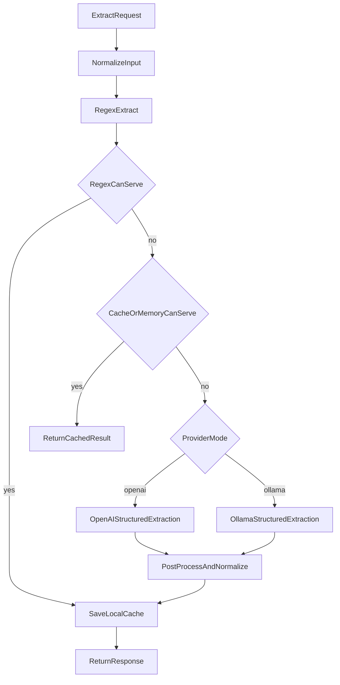

# Hybrid Provider Extraction

## Goal
Move the app from a single-provider runtime to a hybrid extraction flow where regex and local memory/cache are tried first, and only requests they cannot serve are sent to a configurable provider mode: `openai` or `ollama`.

## Current Integration Points
The current extraction path lives in [app/extractor.py](/Users/rana/Documents/GitHub/contact_info_finder/app/extractor.py) and already has the right high-level stages:

```118:176:/Users/rana/Documents/GitHub/contact_info_finder/app/extractor.py
response = self.ollama_client.chat(
    model=self.model,
    ...
    format='json',
)
...
result = json.loads(json_str)
```

The existing local cache abstraction lives in [app/database.py](/Users/rana/Documents/GitHub/contact_info_finder/app/database.py):

```72:124:/Users/rana/Documents/GitHub/contact_info_finder/app/database.py
def add_extraction(self, text: str, extraction: ExtractedContact, embedding: Optional[List[float]] = None):
    ...

def find_similar(self, text: str, n_results: int = 5) -> List[Dict]:
    ...
```

## Proposed Runtime Flow


## Implementation Plan
- Add provider-mode settings in [app/config.py](/Users/rana/Documents/GitHub/contact_info_finder/app/config.py):
  - `llm_provider` with values like `openai` or `ollama`
  - `llm_enabled`
- Add OpenAI settings alongside the existing Ollama settings:
  - `openai_api_key`
  - `openai_model`
  - `openai_timeout_seconds`
  - optional `cache_normalization_version`
- Update `.env` and `env.example` to document:
  - provider selection
  - OpenAI variables
  - existing Ollama variables
  - cache/memory behavior
- Add the official OpenAI Python SDK to [requirements.txt](/Users/rana/Documents/GitHub/contact_info_finder/requirements.txt).

- Introduce a small local exact-match cache layer, likely as a new module such as [app/cache_store.py](/Users/rana/Documents/GitHub/contact_info_finder/app/cache_store.py), backed by SQLite for low operational complexity.
  - Store normalized-text hash
  - Store normalized source text
  - Store parsed extraction JSON
  - Store active provider, model name, and prompt/schema version for safe invalidation
  - Support exact-match or in-memory lookup before any LLM fallback
  - Keep the existing Chroma similarity cache optional rather than required for the critical path

- Refactor [app/extractor.py](/Users/rana/Documents/GitHub/contact_info_finder/app/extractor.py):
  - Keep `FastExtractor.extract_fast()` as the first pass for every request
  - Add normalization and local memory/cache lookup before any provider call
  - Only invoke the selected provider when regex does not produce a usable result and cache or memory also cannot serve the request
  - Split provider-specific extraction into wrappers such as `_extract_with_openai()` and `_extract_with_ollama()`
  - Route provider fallback based on `llm_provider`
  - Use structured JSON output for both providers where supported
  - Reuse the existing `_parse_extraction()` and phone/address post-processing so downstream behavior stays stable
  - Preserve a clear fallback path if the selected provider is unavailable

- Add provider-aware prompt/schema handling in [app/prompts.py](/Users/rana/Documents/GitHub/contact_info_finder/app/prompts.py), keeping the extraction contract aligned with [app/models.py](/Users/rana/Documents/GitHub/contact_info_finder/app/models.py).
  - Keep a compact extraction prompt to minimize tokens
  - Request strict schema-shaped JSON
  - Reuse as much prompt structure as possible across OpenAI and Ollama

- Update health and stats behavior:
  - `health` should report the selected provider and whether that provider is reachable
  - `stats` should expose local cache hit information if practical

- Add targeted verification:
  - one regex-only success case
  - one cache-hit case that avoids provider usage
  - one OpenAI fallback case
  - one Ollama fallback case
  - one structured contact example to confirm equivalent output across both modes

## Key Design Choices
- Keep regex first because it is already extremely fast locally and can eliminate many LLM calls entirely.
- Add local memory or exact-match caching before LLM fallback to minimize repeated token spend and repeated provider latency.
- Support `openai` and `ollama` as selectable provider modes so runtime choice can differ between local, staging, and production.
- Prefer SQLite exact caching over Chroma for the critical path because exact hits are the safest and cheapest way to avoid repeat model calls.
- Leave Chroma as optional secondary infrastructure rather than a dependency for the main success path.

## Expected Outcome
- Regex-friendly requests return immediately without any provider call.
- Repeated or normalized-equivalent requests return from local memory/cache without extra provider cost.
- Only requests that regex and cache or memory cannot serve fall through to the selected provider mode, `openai` or `ollama`.
- The same codebase can be configured differently for local, staging, and live environments without changing extraction logic.